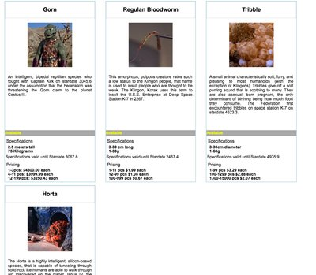

# The Static Web HTML + CSS Quiz

**Author**: Megan Ford April 2016 


Created as a student exercise as part of Nashville Software School's Front End Bootcamp curriculum. Please see below for fulfilled requirements: this exercise is not meant to be a finished production app or indication of current skills, but rather a demonstration of skills learned and utilized at the time of creation.


All images are for educational/example purposes only and are all rights reserved original owners. 


## Instructions


[Requirements For Project](https://github.com/nashville-software-school/front-end-milestones/blob/master/2-the-static-web/quizzes/SW_HTML_CSS.md)


## Install


``` 
git clone https://github.com/MeganCFord/static-web-html-css-quiz-MeganCFord.git
cd html
open index.html
```



## License 


[MIT license](LICENSE.md)


